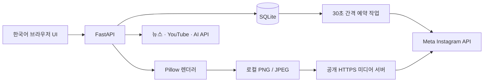

# TECH_SPEC — 기술 명세

## 1. 실행 구조



- Python 3.12+, FastAPI, Uvicorn, SQLite, Pillow, HTTPX, BeautifulSoup.
- HTML/CSS/JavaScript. 별도 프런트엔드 빌드 없이 정적 파일 제공.
- 127.0.0.1:8765에 바인딩. 단일 프로세스 사용. 다중 worker 금지.
- `.env`에 비밀 저장, `.gitignore`로 `.env`, `.venv`, `data` 제외.
- 한국어 글꼴: Windows 맑은 고딕. 다른 OS는 `FONT_PATH` 지정.
- API 모델 ID는 환경 설정으로 교체. 기본값은 비용·최신성 보장이 아닌 초기 설정.

## 2. 데이터 모델

| 테이블 | 주요 필드 | 목적 |
|---|---|---|
| posts | id, body(JSON), status, scheduled_at, created_at | 원고·카드·캡션·출처·검토 결과·예약 |
| settings | key, value(JSON) | 일일 생성 설정 |
| events | id, at, message | 사용자 확인용 실행 기록 |
| runs | day(PK), status, message | KST 일일 생성 중복 실행 방지 |

콘텐츠 ID는 UUID hex. 이미지 경로는 `data/media/{id}/01.png`, `01.jpg`.
자산은 `data/assets/{uuid}.jpg`, 메타데이터 `.json`. API 키를 DB·로그에 저장하지 않는다.

## 3. 주요 API

| 메서드/경로 | 동작 |
|---|---|
| GET /api/status | 키 존재 여부, 일일 설정. 인증 성공을 뜻하지 않음 |
| POST /api/import | 공개 기사 본문 / YouTube 제목·설명 |
| GET /api/discover?category=AI | Naver 뉴스, YouTube 차트 수집 |
| POST /api/generate | 원고·장수·비율·이미지 옵션 → 카드 생성 |
| GET /api/posts | 보관함 목록 |
| PUT /api/posts/{id} | 문안·캡션·출처·검토 수정 및 재렌더링 |
| GET /api/posts/{id}/download | 현재 카드 PNG, caption.txt, content.json ZIP |
| POST /api/posts/{id}/schedule | KST 미래 시각 예약 |
| POST /api/posts/{id}/cancel | 예약 취소 |
| GET /api/images/search | Openverse 검색 |
| POST /api/assets/upload | 최대 15MB 이미지 정규화 저장 |
| POST /api/assets/web | 공개 이미지 다운로드, 출처 저장 |
| PUT /api/daily | 일일 초안 생성 설정 |
| POST /api/daily/run | 오늘 분량 생성. 동일 날짜 재실행 차단 |
| GET /api/events | 최근 실행 기록 |

OpenAPI 개발 UI: `/docs`. 로컬 사용을 전제로 한다.

## 4. 생성과 렌더링

로컬 모드는 문장을 분리해 원고를 카드에 배치한다. AI나 팩트체커가 아니다.
AI 모드는 Responses API의 JSON Schema 구조화 출력을 요청하고 장수·문자 수를 검증한다.
외부 원문은 명령이 아닌 데이터로 처리하며, 가짜 반응·인용·수치를 생성하지 않도록 지시한다.
이 프롬프트는 정확성을 보장하지 않으므로 운영자의 원문 대조가 필요하다.

Pillow가 한글 줄바꿈과 공간 맞춤을 수행한다. 이미지가 있으면 비율 크롭·채도 보정을 적용한다.
각 장 PNG와 JPEG를 함께 저장한다. Meta에는 JPEG, 다운로드에는 PNG를 사용한다.
9:16은 스토리용 파일 제작만 지원하며 피드 게시 커넥터에서 차단한다.

## 5. 소재 수집과 일일 작업

- Naver: 날짜순 뉴스 검색. 원문 URL을 우선 사용. 조회수 데이터 없음.
- 뉴스 점수: 관련성 기본 40 + 신선도 최대 30 + 실용 키워드 5~15.
- YouTube: KR mostPopular 차트, 카테고리별 제목 키워드 필터, 누적 조회수 표시.
- YouTube 점수: `min(99, round(40 + log10(views + 1) * 8))`.
- 점수는 소스마다 다른 편집 우선순위이며 플랫폼 전체의 정확한 인기 순위가 아니다.
- 일일 생성은 카테고리별 결과를 번갈아 처리하고 70점 이상, 기존 URL 제외.
- 자동 제작에서 YouTube는 자막 미지원이므로 제외. 뉴스 원문 추출 성공 건만 AI 생성.
- 결과가 목표 10개보다 적으면 미달 사유를 기록한다.
- 매일 설정 시각 이후 첫 실행에서 당일 1회 처리. 서버가 꺼진 과거 날짜의 작업은 소급 생성하지 않는다.
- 일일 실행 중 비정상 종료 시 `running` 상태가 남을 수 있다. 자동 재실행하지 않고 로그/DB 점검한다.

## 6. 인스타그램 예약 게시

사용자 확인: 계정은 프로페셔널. 아직 토큰·권한·계정 ID 실검증은 하지 않았다.
선택한 연결 방식은 **Instagram API with Instagram Login**이다. Facebook Login 토큰과 혼용하지 않는다.

환경 값:

```dotenv
INSTAGRAM_ACCESS_TOKEN=권한이 있는_사용자_토큰
INSTAGRAM_USER_ID=인스타그램_사용자_ID
META_API_VERSION=v24.0
PUBLIC_MEDIA_BASE_URL=https://your-media-host.example
```

Meta 앱에서 현재 지원하는 API 버전을 확인해 바꿀 수 있다. 일반적으로 필요한 게시 권한은
`instagram_business_basic`, `instagram_business_content_publish`이며 앱 모드·대상 계정에 따른
권한 심사와 토큰 수명은 Meta 개발자 콘솔에서 확인해야 한다.

1. 사실·권리 확인 저장 및 미래 KST 시간 입력.
2. 하루 예약/게시 합계 최대 10개 확인.
3. 예약 시각 도달 시 이미지 컨테이너 생성, FINISHED 상태 확인.
4. 여러 장이면 CAROUSEL 컨테이너 생성.
5. `media_publish` 직전에 container ID와 publishing 상태 저장.
6. 성공하면 Instagram media ID, 게시 시각 저장.
7. 최종 게시 요청 결과가 불명확하면 `needs_check`로 중단. 중복 위험 때문에 자동 재시도하지 않음.

상태: `draft → scheduled → publishing → published`.
게시 전 오류는 `failed`, 최종 요청 중 연결 오류는 `needs_check`.
예약 취소는 `scheduled/failed → draft`. 예약 중 편집은 차단한다.
실패한 콘텐츠는 원인을 고친 뒤 취소/다시 예약. `needs_check`는 실제 계정 상태를 확인한 뒤 운영자가 조정한다.

### 공개 미디어 제공

Meta가 `{PUBLIC_MEDIA_BASE_URL}/{콘텐츠ID}/01.jpg`에 접근할 수 있어야 한다.
앱 전체를 공개하면 안 된다. `data/media`만 별도 정적 호스팅 또는 미디어 전용 서버로 제공한다.
정적 호스팅 사용 시 **새로 생성된 파일도 계속 동기화해야 한다**. 이 프로젝트는 클라우드 업로드를 자동 설정하지 않는다.
동일 PC의 미디어 전용 서버를 승인된 HTTPS 터널에 연결하면 새 이미지가 곧바로 제공된다.

```powershell
.\.venv\Scripts\python.exe -m uvicorn app.media_server:app --host 127.0.0.1 --port 8766
```

8766만 공개 대상이다. 8765의 편집 API, DB, `.env`, 원본 영상은 공개하지 않는다.
HTTPS 터널 서비스와 접근 정책의 연결은 아직 수행하지 않았다.

## 7. 오류·보안·운영 제약

- 필드 길이/장수/비율 검증, 이미지 용량 제한, 로컬/사설 URL 및 리디렉션 검사.
- Host allowlist, 다른 사이트 Origin의 수정 요청 차단. 인증된 공개 서비스의 대체물이 아님.
- URL DNS 확인과 실제 연결 사이의 DNS 재바인딩까지 완전히 방어하는 공개 프록시 설계는 아님. 로컬 전용 유지.
- 원문 차단, 네트워크 오류, 권한 만료를 사용자에게 표시. 실패를 성공으로 기록하지 않음.
- SQLite와 자산을 함께 백업. 프로그램 업데이트 전 `data/`를 보존.
- 현재 데이터 증가에 따른 자동 삭제/보관 정책, 게시 결과 재조정 UI, 서버 장애 알림은 미구현.
- 메인 예약 루프 안에서 생성이 길어지면 게시가 지연될 수 있음. 상시 운영 전 별도 작업 큐로 분리 권장.

## 8. 검증 기준

테스트는 격리된 임시 SQLite/이미지 폴더 사용. Meta API 호출은 모킹하여 성공·불명확 결과를 검증한다.
실제 외부 키 호출·결제·게시 테스트와 구분한다. 상세 결과: `TEST_REPORT.md`.

## 공식 참고 자료 (2026-09-29 확인)

- https://www.postman.com/meta/instagram/documentation/6yqw8pt/instagram-api
- https://developers.facebook.com/docs/instagram-platform/instagram-api-with-instagram-login/content-publishing/
- https://developers.google.com/youtube/v3/docs/videos/list
- https://developers.openai.com/api/docs/guides/structured-outputs
- https://developers.openai.com/api/reference/cli/resources/images/methods/generate
- https://developers.naver.com/docs/serviceapi/search/news/news.md
- https://docs.openverse.org/api/

Meta 개발자 문서는 이 환경에서 직접 열기가 제한되어 Meta 공식 Postman 자료를 함께 참고했다.
