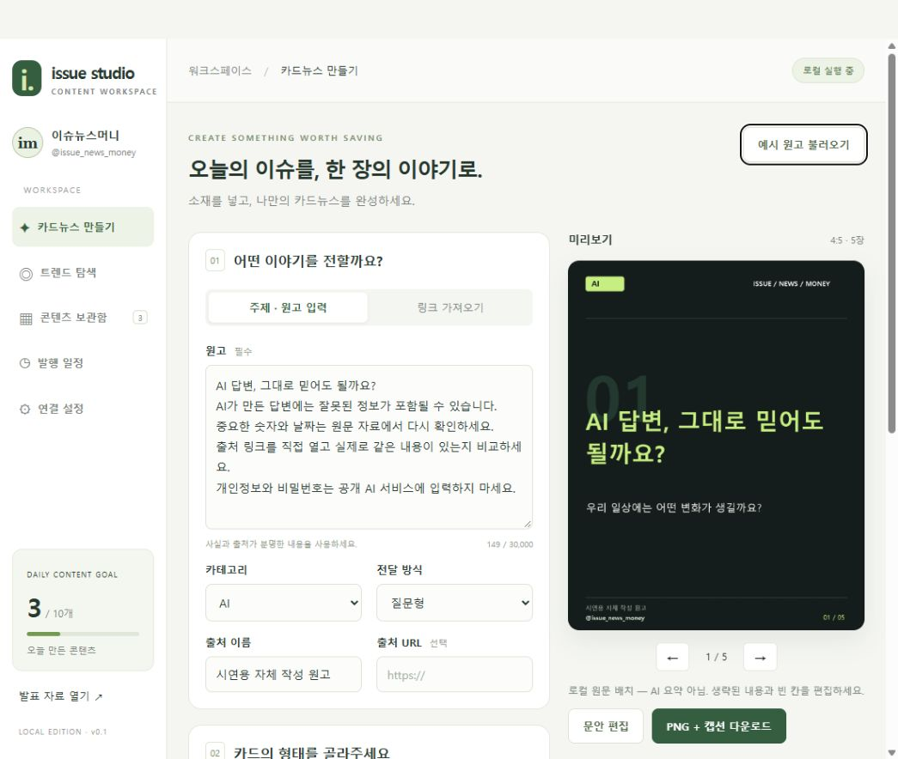

# Issue Studio — 이슈뉴스머니 카드뉴스 제작실

`@issue_news_money`를 위한 **소재 탐색 → 카드 제작 → 검토 → 예약 발행** 프로그램입니다.
한국어 원고로 1~10장 카드뉴스를 만들고 PNG 이미지, 캡션, 편집 정보를 ZIP으로 저장합니다.

> 제출일: **2026년 10월 2일 금요일**. 현재 버전: **v0.1 · 로컬 실행 MVP**.
> 카드 제작은 실행 검증 완료. 외부 API와 실제 인스타그램 게시의 운영 검증은 연결 후 진행해야 합니다.

저장소: https://github.com/reco5149-art/issue-news-money-studio (비공개)



## 바로 실행

Windows에서 Python 3.12 이상을 설치한 뒤 **`start.bat`를 더블 클릭**하세요.
첫 실행에는 필요한 패키지를 설치하므로 인터넷이 필요합니다.

브라우저에서 **http://127.0.0.1:8765** 에 접속합니다.

```powershell
python -m venv .venv
.\.venv\Scripts\python.exe -m pip install -r requirements.txt
.\.venv\Scripts\python.exe -m uvicorn app.main:app --host 127.0.0.1 --port 8765
```

서버 창을 닫으면 예약 작업도 멈춥니다. 서버는 **1개 프로세스**로 실행하세요.
현재 URL은 같은 PC에서 사용하는 주소이며, 인터넷 공개 체험 URL이 아닙니다.

## 3분 시연

1. `예시 원고 불러오기`를 클릭합니다. 실제 속보가 아닌 자체 작성 시연 원고입니다.
2. 장수 5장, 비율 4:5, 로컬 원문 배치, 자체 디자인을 선택합니다.
3. `카드뉴스 생성하기` → 미리보기에서 카드를 넘깁니다.
4. `문안 편집`에서 제목을 바꾸고 저장합니다.
5. `PNG + 캡션 다운로드`로 ZIP을 저장합니다.
6. 보관함, 발행 일정, 연결 설정을 보여줍니다. 미연결 기능은 미연결 상태 그대로 설명합니다.
7. [발표 자료](Presentation/index.html)를 열거나 http://127.0.0.1:8765/presentation 에 접속합니다.

## 기능과 현재 지원 범위

| 기능 | 현재 구현 | 필요한 연결 / 한계 |
|---|---|---|
| 원고 → 카드 | 원문 문장 배치, 편집, CTA, 캡션 | 로컬 모드는 AI 요약이 아닙니다. 생략·빈 칸 검토 필요 |
| AI 요약·후킹 | OpenAI Responses 구조화 응답 | OpenAI API 키, 이용 가능한 모델, 별도 API 요금 |
| 장수·비율 | 1~10장, 자동 장수, 4:5·1:1·9:16 | 9:16은 파일 저장용, 인스타 피드 예약 제외 |
| 뉴스·블로그 URL | 공개 HTML 본문 추출 | 차단·유료·자바스크립트 전용 페이지는 원고 붙여넣기 |
| YouTube URL | 제목·설명·채널 | YouTube API 키. 자막·영상 내용 분석 아님 |
| Instagram·TikTok URL | 출처 URL로 보존 | 본문·영상 자동 다운로드 미구현. 원고/보유 영상 입력 |
| 자체 이미지 | 타이포 디자인 / AI 이미지 생성 | AI 사진에는 생성 표시, 이미지 API 키 필요 |
| 웹 이미지 | Openverse 검색·선택 | 네트워크 접근, 개별 라이선스·인물 권리 검토 |
| 영상 캡처 | 보유 영상의 현재 프레임 캡처 | 브라우저가 재생 가능한 영상. 카드 크롭·색감 적용 |
| 트렌드 탐색 | Naver 뉴스, YouTube 인기 차트 | 키 필요. 뉴스는 조회수가 아닌 신선도 기반 점수 |
| 매일 10개 초안 | 한국 시간 일정, 최대 10개, 일일 중복 실행 방지 | Naver + OpenAI 키. 소재 부족 시 미달 수량 기록 |
| 예약 자동 게시 | 단일 이미지/캐러셀, 하루 최대 10개 | Instagram Login 토큰·ID·공개 미디어 주소·검토 저장 |
| 완전 무검토 게시 | 미구현 | 현재는 초안 검토 후 예약하는 흐름 |

외부 커넥터는 코드가 구현되어 있지만 실키 호출·실계정 게시 검증은 아직 하지 않았습니다.
실행 가능한 핵심 기능과 실제 외부 연결 완료를 구분합니다.

## 연결 설정

`.env.example`을 `.env`로 복사하고 필요한 항목을 입력한 뒤 재시작하세요.
키를 채팅, 소스 코드, GitHub에 올리지 마세요. `.env`와 `data/`는 Git에서 제외됩니다.

- `OPENAI_API_KEY`: AI 원고·이미지. 모델은 `OPENAI_TEXT_MODEL`, `OPENAI_IMAGE_MODEL`에서 변경.
- `NAVER_CLIENT_ID`, `NAVER_CLIENT_SECRET`: Naver 뉴스 검색.
- `YOUTUBE_API_KEY`: 영상 제목·설명·조회수 조회.
- `INSTAGRAM_ACCESS_TOKEN`, `INSTAGRAM_USER_ID`: Instagram Login으로 연결한 프로페셔널 계정.
- `PUBLIC_MEDIA_BASE_URL`: 생성된 JPEG를 Meta가 읽을 수 있는 공개 HTTPS 이미지 폴더 URL.
- `META_API_VERSION`: Meta 앱에서 지원되는 Graph API 버전 확인 후 지정.

세부 내용은 [기술 명세](DevelopDoc/TECH_SPEC.md)를 참고하세요.

## 프로젝트 구성

```text
README.md
DevelopDoc/
  PRD.md
  TECH_SPEC.md
  WORK_UNITS.md
  FINAL_CHECKLIST.md
  DEVELOPMENT_SCHEDULE.md
  TEST_REPORT.md
Presentation/
  index.html
  SPEAKER_NOTES.md
app/              # API, 이미지 렌더러, DB, 외부 서비스, 예약 작업
static/           # 한국어 제작 화면
tests/            # 핵심 동작 회귀 테스트
start.bat
.env.example
requirements.txt
data/             # 실행 시 생성. SQLite, 이미지. Git 제외
```

## 테스트

```powershell
.\.venv\Scripts\python.exe -m pytest -q
node --check static/app.js
```

테스트는 임시 데이터 폴더를 사용하고 실제 인스타그램에 게시하지 않습니다.
운영 자료는 `data/`를 백업하고, 복원할 때 서버를 먼저 종료하세요.

## 개발·제출 문서

- [제품 요구사항](DevelopDoc/PRD.md)
- [기술 명세](DevelopDoc/TECH_SPEC.md)
- [단위 작업 및 완료조건](DevelopDoc/WORK_UNITS.md)
- [최종 완료 체크리스트](DevelopDoc/FINAL_CHECKLIST.md)
- [9/29~10/2 개발 일정](DevelopDoc/DEVELOPMENT_SCHEDULE.md)
- [테스트 결과](DevelopDoc/TEST_REPORT.md)
- [API 키 발급·연결 안내](DevelopDoc/API_SETUP.md)
- [발표 자료](Presentation/index.html) · [발표 대본](Presentation/SPEAKER_NOTES.md)

## 참고한 공식 문서

- [Meta Instagram API](https://www.postman.com/meta/instagram/documentation/6yqw8pt/instagram-api)
- [YouTube 인기 영상 조회](https://developers.google.com/youtube/v3/docs/videos/list)
- [OpenAI 구조화 출력](https://developers.openai.com/api/docs/guides/structured-outputs)
- [Naver 뉴스 검색 API](https://developers.naver.com/docs/serviceapi/search/news/news.md)

조회수·저장·댓글 성과를 보장하지 않습니다. 사실 확인과 이미지 권리 확인은 운영자가 수행하며,
영상 캡처를 크롭하거나 색상을 바꾸는 것만으로 사용 권한이 생기지는 않습니다.
